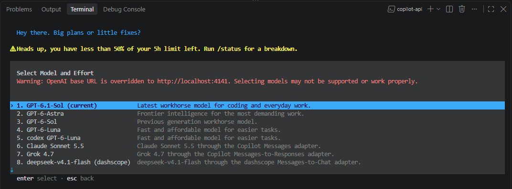

# Codex

[项目首页](../../../README.zh-CN.md) · [文档目录](README.md) · [English](../en/codex.md)

<a id="using-with-codex"></a>

## 与 Codex 一起使用

这个 AI gateway 也可以为 Codex 提供后端能力。

推荐使用 Codex `0.160.0` 或更高版本：这些客户端会从 `model_catalog_url` 加载模型目录，因此本地 `model_catalog_json` 文件是可选的。

远程目录响应限制为 1 MiB JSON。合并后的目录超出该限制时，网关会优先保留通过 provider `agentsModels` 选中的模型，其余模型会被丢弃。请在 Provider 管理页选择需要的模型；如果需要完整列表，则生成本地目录文件。

当 `modelMappings` 已将裸名 `model` 映射到同一个 `codex/model` 时，Codex 目录会省略重复的 `codex/model` 条目并保留裸名的完整元数据。默认的 `codex-auto-review` 和 `gpt-reserve` 映射也适用。显式前缀调用继续可用；映射到其他模型或 provider 时保留前缀条目。

### Codex `config.toml` 参考配置

在 `~/.codex/config.toml` 中加入：

```toml
model = "gpt-6.1-sol"
model_reasoning_effort = "max"
model_provider = "copilot_api"
model_reasoning_summary = "auto"
plan_mode_reasoning_effort = "max"
# 上下文窗口和自动压缩阈值（单位：token）可自行调整。
# 按 OpenAI API 定价，GPT 模型（如 gpt-6.1-sol）输入超过 272000 token 时，
# 输入及缓存费用翻倍，输出费用为 1.5 倍。
model_context_window = 272000
model_auto_compact_token_limit = 244800
# 沙箱策略。可改用 "workspace-write" 以启用限制。
sandbox_mode = "danger-full-access"
approvals_reviewer = "auto_review"
suppress_unstable_features_warning = true
web_search = "live"
service_tier = "default"
# 可选：Codex 0.160.0+ 会使用上方的远程目录。仅当需要使用由
# docs/generate-model-catalog.sh 生成的本地完整目录时，才取消下一行注释。
# model_catalog_json = "model_catalog.json"

[model_providers.copilot_api]
name = "OpenAI"
base_url = "http://localhost:4141"
model_catalog_url = "http://localhost:4141/models"
env_key = "GITHUB_COPILOT_API_KEY"
requires_openai_auth = true
supports_websockets = false
supports_standalone_web_search = true
wire_api = "responses"
request_max_retries = 3
stream_max_retries = 3
stream_idle_timeout_ms = 300000

[features]
remote_compaction_v2 = true
api_key_model_discovery = true
default_mode_request_user_input = true
standalone_web_search = true
daemon_auto_start = false
apps = false

[desktop]
enabled-reasoning-efforts = ["low", "medium", "high", "xhigh", "ultra", "max"]

[analytics]
enabled = false
```

> [!NOTE]
> `name` 一定要配置为 `"OpenAI"`。
>
> 使用 Codex 需先通过 ChatGPT 或 API Key 登录。`requires_openai_auth = true` 用于在 UI 中显示登录账号信息，ChatGPT 登录时还可显示额度和订阅信息；请求鉴权仍优先使用 `env_key`。如需绕过 Codex 客户端的账号限制，可尝试设为 `false`。注意：设为 `false` 后，桌面应用会隐藏 Remote（**Settings → Connections** 中的 **Control this Mac**）（[openai/codex#36879](https://github.com/openai/codex/issues/36879)）。
>
> `GITHUB_COPILOT_API_KEY` 需设置为系统级用户环境变量，以便 Codex 应用也能读取。填写任一[网关 API Key](cli.md#auth-命令选项)；未配置 Key 时，填写任意非空占位值即可。未设置时，Codex 会报 `Missing environment variable` 错误。

### 自动审核模型映射

通过顶层 GitHub Copilot 路由使用 `approvals_reviewer = "auto_review"` 时，在网关 `config.json` 中加入以下映射：

```json
{
  "modelMappings": {
    "codex-auto-review": "gpt-5.6-luna"
  }
}
```

也可配置为 `"codex-auto-review": "codex/codex-auto-review"`，使用内置 `codex` provider。

### 一键生成 `model_catalog.json`

需要完整模型列表、使用 Codex `0.160.0` 之前的版本，或需要避开远程响应的 1 MiB 限制时，使用本地目录文件。生成脚本携带 `x-full-model-catalog: true`，绕过大小和默认模型排除限制，仍遵守 provider 启停状态及 `agentsModels` 名单；该 header 不会转发给上游。Provider 名单设置详见[配置说明](configuration.md)。

启动网关，安装 `curl` 及 Bun 或 Node.js，然后在仓库根目录运行[生成脚本](../../generate-model-catalog.sh)：

```sh
sh docs/generate-model-catalog.sh
```

默认连接 `http://localhost:4141`，输出至 `$HOME/.codex/model_catalog.json`；如需自定义，依次追加网关地址和输出路径参数。

- **鉴权：** 网关启用鉴权时，运行脚本前设置 `GITHUB_COPILOT_API_KEY`。
- **配置：** 生成后取消 `model_catalog_json` 的注释，并填入文件的绝对路径。
- **更新：** 网关模型或 provider 变化后，重新运行脚本并重启 Codex。

### Codex 模型目录与协议适配

模型目录会按客户端版本适配：Codex `0.160.0` 及以上版本使用规范字段 `model_messages.instructions_template`，不再返回重复的旧字段 `base_instructions`；较旧客户端保留兼容字段。

Codex 模型选择界面会展示网关已配置 provider 提供的模型：



> **模型切换：** 在 DeepSeek 与 Responses Lite 模型之间切换时，请新建 Codex 会话。

### Codex provider 价格估算

内置 `codex` provider 展示的费用为按 [OpenAI API 价格](https://developers.openai.com/api/docs/pricing)计算的价格估算，不代表 Codex 套餐的实际扣费或额度消耗。倍率根据请求中的 `service_tier` 统一计算，不按模型过滤：`fast` / `priority` 使用 2×，`ultrafast` 使用 6×，其余 tier 使用标准价格。上游响应返回 `default` 不会覆盖请求中的 tier。

---
